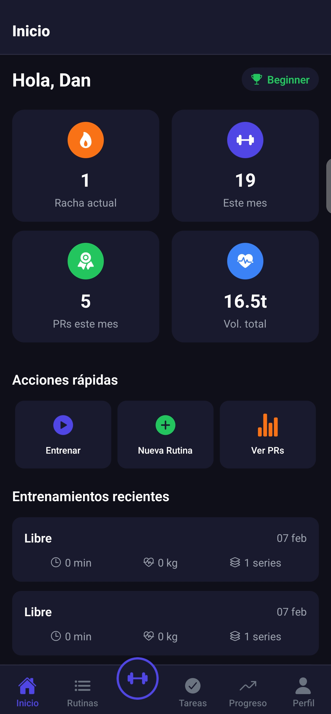
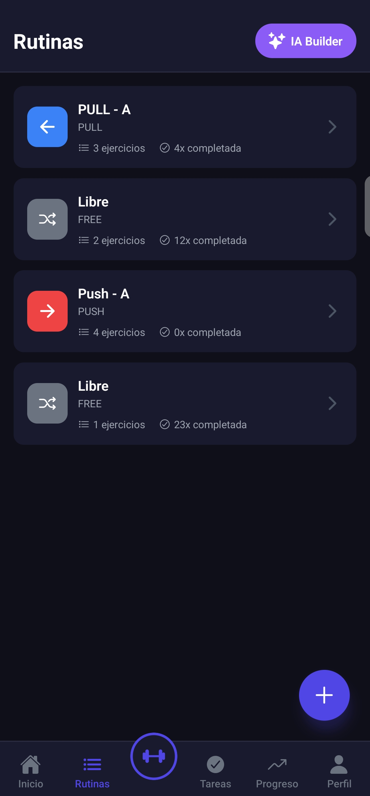
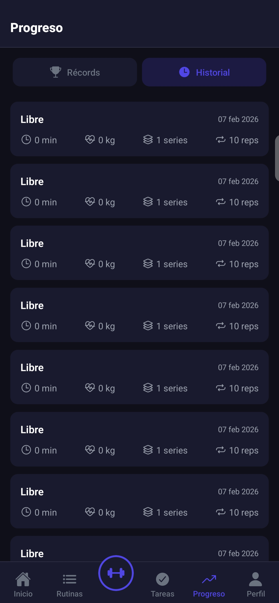

# 🏋️ ToDo-Fit Plus - DEMO SHOWCASE

**Aplicación móvil de gestión de tareas y entrenamiento fitness integrado**

Una app híbrida que combina gestión de tareas diarias con seguimiento completo de entrenamientos, permitiendo crear objetivos fitness que se autocompletan al lograrlos.

> **📝 Nota**: Este repositorio contiene únicamente la documentación y demos visuales del proyecto. El código fuente se mantiene privado para protección de propiedad intelectual de cara al lanzamiento en producción.

**[📱 Ver Demo Visual](#-demo-visual)** | **[✨ Features](#-características-principales)** | **[🛠️ Tech Stack](#️-stack-tecnológico)**

---

## 📱 Demo Visual

### 🔐 Login y Dashboard
<table>
  <tr>
    <td align="center" width="50%">
      
       
      <b>Autenticación Segura</b>
       
      Sistema de login con JWT
    </td>
    <td align="center" width="50%">
      
       
      <b>Dashboard Principal</b>
       
      Vista general de tu progreso
    </td>
  </tr>
</table>

### 📋 Gestión de Tareas
<table>
  <tr>
    <td align="center" width="100%">
      
       
      <b>Organiza tu Día</b>
       
      Categorías: Trabajo, Personal, Fitness | Prioridades: Alta, Media, Baja
    </td>
  </tr>
</table>

### 💪 Sistema de Entrenamiento
<table>
  <tr>
    <td align="center" width="33%">
      
       
      <b>Rutinas Personalizadas</b>
       
      Crea y edita tus entrenamientos
    </td>
    <td align="center" width="33%">
      
       
      <b>Constructor de Rutinas</b>
       
      Diseña workouts personalizados
    </td>
    <td align="center" width="33%">
      
       
      <b>Biblioteca de +100 Ejercicios</b>
       
      Clasificados por grupo muscular
    </td>
  </tr>
</table>

### 🏋️ Workout Activo e Historial
<table>
  <tr>
    <td align="center" width="33%">
      
       
      <b>Sesión en Vivo</b>
       
      Temporizador, series y seguimiento real-time
    </td>
    <td align="center" width="33%">
      
       
      <b>Historial Completo</b>
       
      Revisa todos tus entrenamientos pasados
    </td>
    <td align="center" width="33%">
      
       
      <b>Perfil de Usuario</b>
       
      Configuración y estadísticas
    </td>
  </tr>
</table>

---

## ✨ Características Principales

### 🎯 Gestión de Tareas
- ✅ Crear, editar y eliminar tareas
- ✅ Categorías: Trabajo, Personal, Fitness
- ✅ Prioridades: Alta, Media, Baja
- ✅ Filtrado por estado (completadas/pendientes)
- ✅ **Tareas fitness con auto-completado inteligente**

### 💪 Sistema de Entrenamiento
- ✅ Crear y editar rutinas personalizadas
- ✅ Biblioteca de +100 ejercicios clasificados por grupo muscular
- ✅ Seguimiento de series, repeticiones y peso
- ✅ Temporizador de descanso entre series
- ✅ Historial completo de entrenamientos
- ✅ Agregar ejercicios durante el workout

### 🎨 Interfaz de Usuario
- ✅ Tema oscuro optimizado
- ✅ Modales personalizados (sin alerts nativos)
- ✅ Animaciones fluidas y feedback visual
- ✅ Diseño responsive
- ✅ Navegación por tabs intuitiva

### 🔐 Seguridad
- ✅ Autenticación JWT robusta
- ✅ Encriptación de contraseñas con bcrypt
- ✅ Validación de datos en frontend y backend
- ✅ Manejo seguro de sesiones

---

## 🛠️ Stack Tecnológico

### Frontend
- **React Native** - Framework móvil multiplataforma
- **Expo Router** - Navegación file-based
- **Zustand** - State management minimalista
- **TypeScript** - Type safety
- **Axios** - HTTP client

### Backend
- **FastAPI** - Framework web Python moderno
- **MongoDB** - Base de datos NoSQL
- **Motor** - MongoDB async driver
- **JWT** - Autenticación token-based
- **bcrypt** - Hash de contraseñas
- **Pydantic** - Validación de datos

### DevOps (Próximamente)
- **Railway/Render** - Deploy backend
- **MongoDB Atlas** - Base de datos en la nube
- **Expo EAS** - Build y distribución móvil

---

## 🔮 Roadmap

### 🎯 Próximas Funcionalidades
- [ ] **IA Routine Builder** - Generación de rutinas con IA
- [ ] **Estadísticas Avanzadas** - Gráficos de progreso y PRs
- [ ] **Planificación Semanal** - Calendario de entrenamientos
- [ ] **Modo Offline** - Sincronización automática
- [ ] **Videos de Ejercicios** - Guías visuales

### 🚀 En Desarrollo
- [ ] Sistema de notificaciones push
- [ ] Social features (compartir entrenamientos)
- [ ] Integración con wearables
- [ ] Nutrition tracking
- [ ] Calculadora de 1RM

---

## 📊 Estado del Proyecto

**Versión Actual**: 1.0.0 (Producción Ready)  
**Estado**: ✅ Funcional y estable  
**Última Actualización**: Febrero 2026

### ✅ Completado
- [x] Autenticación JWT
- [x] CRUD tareas y rutinas
- [x] Sesiones de entrenamiento
- [x] Auto-completado de tareas fitness
- [x] Historial de workouts
- [x] UI/UX optimizada

---

## 📞 Contacto

Para consultas sobre colaboración, demos en vivo o información adicional:

- **GitHub**: [@Dan13l-M](https://github.com/Dan13l-M)
- **Repositorio Demo**: [ToDo-Fit Plus Showcase](https://github.com/Dan13l-M/todo-fit-plus-showcase)

---

## 📄 Licencia

© 2026 ToDo-Fit Plus. Todos los derechos reservados.  
El código fuente es propietario y no está disponible públicamente.

---

**🏋️ Construyendo el futuro del fitness tracking - Una tarea a la vez**
