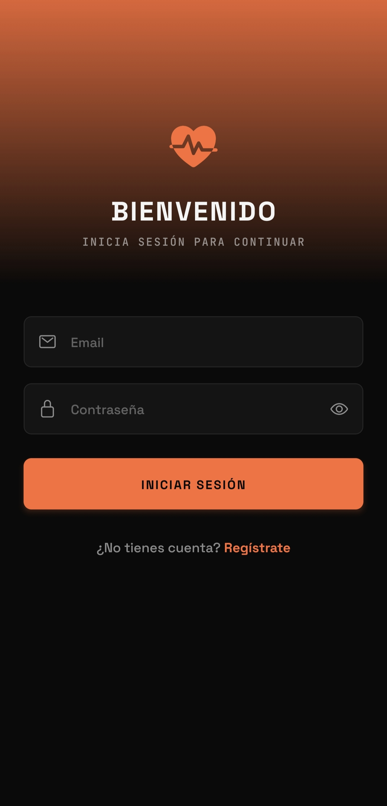
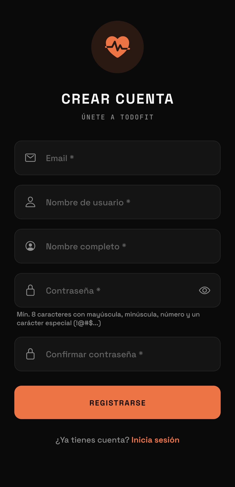
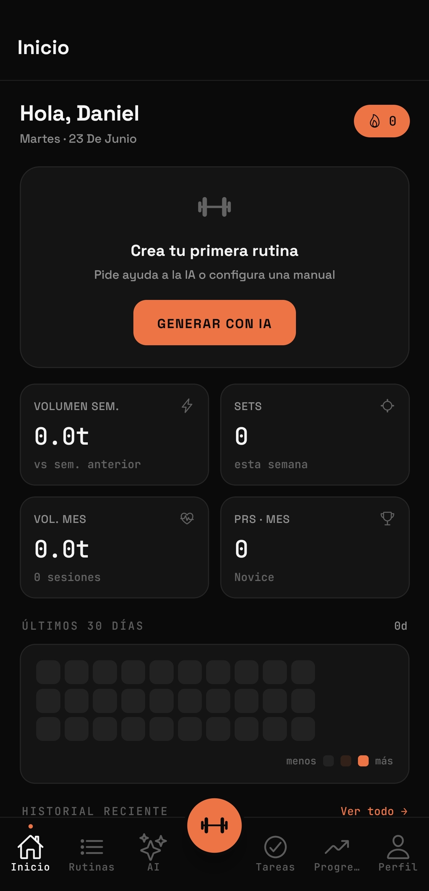
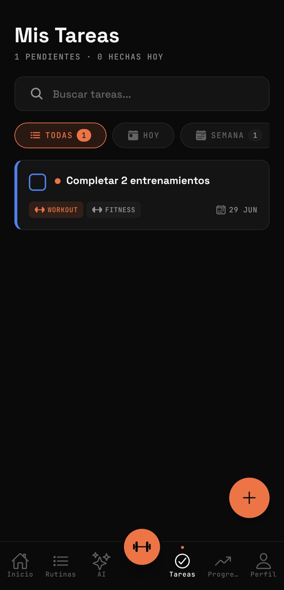
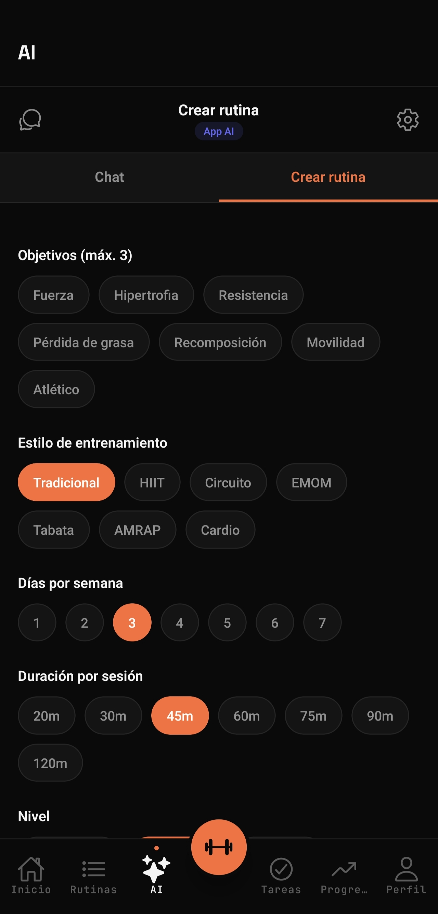
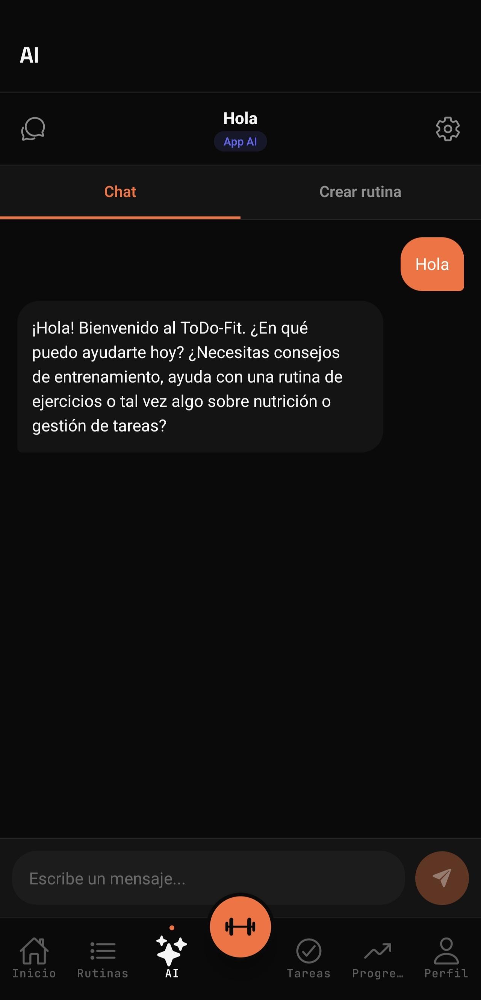
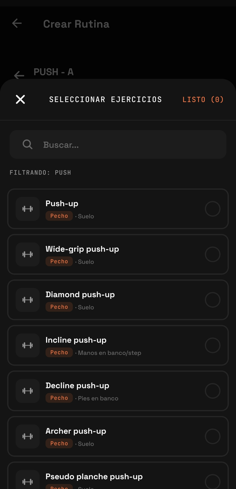
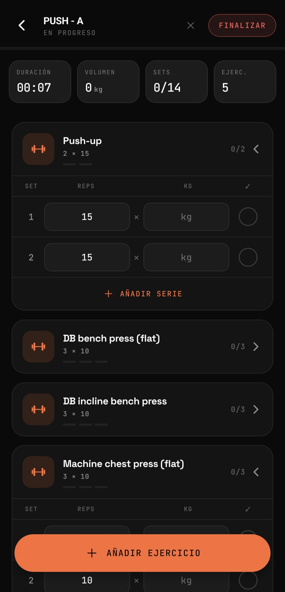
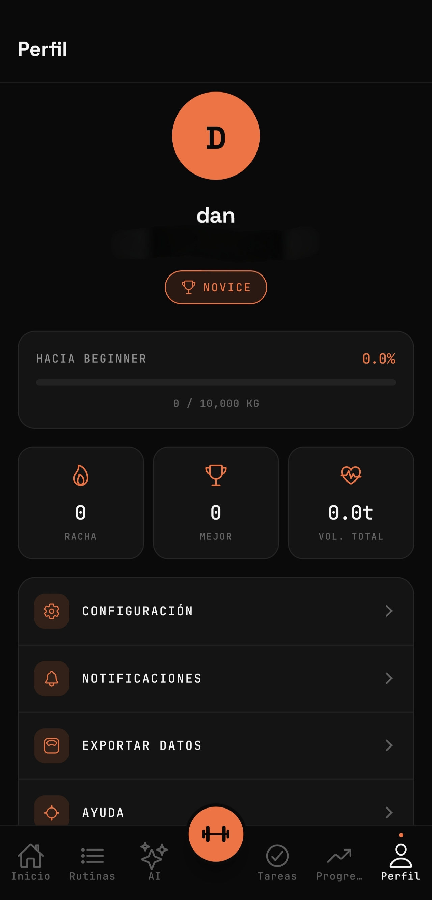

# 🏋️ ToDo-Fit Plus — Showcase

**App móvil híbrida de gestión de tareas + entrenamiento fitness con IA**

ToDo-Fit Plus combina la gestión de tareas diarias con un sistema completo de entrenamiento. Su modelo de **tareas tipadas** (`workout` / `nutrition` / `measure` / `reminder` / `goal`), un **builder de rutinas**, **generación de rutinas asistida por IA** y un **design system v2 dark-first** (acento naranja) conforman una experiencia pensada para deportistas que también quieren ordenar su día.

> **📝 Nota:** Este repositorio contiene únicamente documentación y demos visuales. El código fuente se mantiene **privado** para protección de propiedad intelectual de cara al lanzamiento en producción.

> **🤖 Construido con agentes de IA de Claude (Claude Code).** Es un showcase de ingeniería asistida por IA: el proyecto se diseñó e implementó con un flujo de brainstorm → spec → plan → implementación, code review y commits convencionales.

<div align="center">

**[📱 Demo Visual](#-demo-visual)** · **[🧱 Arquitectura](#-arquitectura)** · **[🛠️ Stack](#️-stack-tecnológico)** · **[🧩 Patrones](#-patrones-de-diseño--decisiones)** · **[🔐 Seguridad](#-seguridad)**

</div>

---

## 📱 Demo Visual

### 🔐 Autenticación

<table>
  <tr>
    <td align="center" width="50%">
      
      <br/><b>Login</b><br/>
      Autenticación con JWT (HS256)
    </td>
    <td align="center" width="50%">
      
      <br/><b>Registro</b><br/>
      Alta de usuario con validación Pydantic
    </td>
  </tr>
</table>

### 🏠 Dashboard y Tareas

<table>
  <tr>
    <td align="center" width="50%">
      
      <br/><b>Dashboard Principal</b><br/>
      Vista general del progreso
    </td>
    <td align="center" width="50%">
      
      <br/><b>Tareas Tipadas</b><br/>
      workout · nutrition · measure · reminder · goal
    </td>
  </tr>
</table>

### 🤖 IA: Builder y Chat

<table>
  <tr>
    <td align="center" width="50%">
      
      <br/><b>IA Routine Builder</b><br/>
      Generación de rutinas por IA (BYOK)
    </td>
    <td align="center" width="50%">
      
      <br/><b>IA Chat</b><br/>
      Asistente conversacional con historial por usuario
    </td>
  </tr>
</table>

### 💪 Entrenamiento

<table>
  <tr>
    <td align="center" width="50%">
      
      <br/><b>Selector de Ejercicios</b><br/>
      Catálogo clasificado por grupo muscular
    </td>
    <td align="center" width="50%">
      
      <br/><b>Sesión en Vivo</b><br/>
      Series, repeticiones y seguimiento real-time
    </td>
  </tr>
</table>

### ⚙️ Configuración

<table>
  <tr>
    <td align="center" width="50%">
      
      <br/><b>Configuración</b><br/>
      Tema, unidades, proveedor de IA y cuenta
    </td>
  </tr>
</table>

### 🎬 Video de la app

<video src="https://github.com/Dan13l-M/todo-fit-plus-showcase/raw/main/assets/demo/Screenrecorder.mp4" controls width="320"></video>

▶️ Si el video no se reproduce inline: **[ver / descargar Screenrecorder.mp4](https://github.com/Dan13l-M/todo-fit-plus-showcase/raw/main/assets/demo/Screenrecorder.mp4)**

---

## 🧱 Arquitectura

Cliente **Expo (React Native)** ↔ **API REST FastAPI** ↔ **MongoDB**.

El backend está organizado en **3 capas estrictas** (nunca se saltan capas):

```
┌─────────────────────────────────────────────────────────────┐
│  Cliente móvil — Expo / React Native                         │
│  Expo Router (file-based)  ·  Zustand stores por dominio     │
│  auth · task · workout · ai · folder · theme                 │
└───────────────────────────┬─────────────────────────────────┘
                            │  HTTPS / REST (JWT en header)
                            ▼
┌─────────────────────────────────────────────────────────────┐
│  API REST — FastAPI 0.137                                    │
│                                                              │
│   api/routes/   endpoints + Pydantic DTOs (validación)       │
│        │                                                     │
│        ▼                                                     │
│   services/     lógica de negocio                            │
│        │                                                     │
│        ▼                                                     │
│   repositories/ acceso a datos (Motor / Mongo async)         │
└───────────────────────────┬─────────────────────────────────┘
                            │
                            ▼
┌─────────────────────────────────────────────────────────────┐
│  MongoDB Atlas                                              │
│  users · routines · routine_exercises · sessions ·          │
│  session_exercises · exercise_sets · exercises · tasks ·    │
│  folders                                                     │
└─────────────────────────────────────────────────────────────┘

         ┌──────────────────────────────────────┐
         │  IA — BYOK (Bring Your Own Key)      │
         │  La API key del usuario va al        │
         │  proveedor LLM elegido               │
         │  groq · openai · gemini · anthropic  │
         └──────────────────────────────────────┘
```

- **Backend en 3 capas:** `api/routes` (endpoints + DTOs) → `services` (negocio) → `repositories` (datos). Cada capa sólo conoce a la inmediatamente inferior.
- **Frontend por dominios:** stores Zustand separados (`auth` / `task` / `workout` / `ai` / `folder` / `theme`). El estado global vive en Zustand; el estado puramente de UI vive en `useState`.
- **IA con BYOK:** el usuario aporta su propia API key, que se usa contra el proveedor LLM que elija. La app no centraliza ni revende inferencia.

---

## 🛠️ Stack Tecnológico

| Capa        | Tecnologías |
|-------------|-------------|
| **Frontend** | React Native · Expo SDK 54 · Expo Router (file-based) · Zustand · `react-native-svg` · TypeScript strict |
| **Backend**  | FastAPI 0.137 · Pydantic 2 · Motor (MongoDB async) · PyJWT (HS256) · slowapi · loguru |
| **Base de datos** | MongoDB Atlas |
| **IA** | Multi-provider BYOK: groq · openai · gemini · anthropic |
| **Infra / CI** | Railway (Docker) · Expo EAS · GitHub Actions CI (gate de `pytest` + `tsc`) |

---

## 🧩 Patrones de diseño / decisiones

- **Capas estrictas en backend** — `routes → services → repositories`, sin atajos. La validación vive en los DTOs Pydantic; la lógica nunca toca Mongo directamente.
- **`user_id` siempre `str` en queries Mongo** — convención uniforme para evitar bugs silenciosos de tipos entre `ObjectId` y `str`.
- **`routine_exercises` es la fuente de verdad** — las rutinas no embeben sus ejercicios en `routines.exercises`; la relación se modela en una colección dedicada y el servicio la reconstruye.
- **Auto-catálogo de IA** — los ejercicios generados por IA se **upsertean al catálogo** (`exercises`) para obtener un `ObjectId` válido antes de referenciarlos; nada de ids ficticios que rompan downstream.
- **Design system v2** — hook `usePaletteV2` + primitivas v2 reutilizables (Icon, StatTile, HeroCard, FAB…). Dark-first con acento naranja, ambas paletas cumplen WCAG AA.
- **Aislamiento de estado por usuario** — los stores Zustand se resetean en login/logout para que ningún dato persista entre cuentas.
- **Tipografía** — Space Grotesk (display) + JetBrains Mono (mono / datos).

---

## 🔐 Seguridad

- **Auth:** JWT **HS256** con expiración de 7 días + hashing **bcrypt**. El login es **timing-safe** para mitigar enumeración de usuarios.
- **Rate limiting** (slowapi): `register` 5/min · `login` 10/min · `reset-password` 3/hr.
- **CORS** configurable por `ALLOWED_ORIGINS`.
- **Aislamiento de datos:** todas las queries están scoped por `user_id` y la *ownership* se valida en cada escritura.
- **IA por usuario:** el historial de chat de IA está namespaceado por usuario.
- **Legal:** Privacy Policy y Terms of Service **bilingües**, servidas en `/privacy` y `/terms`.
- **Cadena de dependencias:** **0 vulnerabilidades conocidas** (pip-audit + `pnpm` overrides).
- **Auditoría:** análisis de replay / CSRF documentado.
- **En curso:** migración de auth a **Supabase** (verificación de email + reset de contraseña).

---

## 🤖 Construido con IA

El proyecto se desarrolló de forma asistida por **agentes de IA de Claude (Claude Code)**. El flujo de trabajo combinó:

**brainstorm → spec → plan → implementación → code review → commits convencionales**

Cada sprint partió de una especificación, se planificó en pasos verificables y se implementó con revisión de diffs antes de integrar. Es un showcase de cómo construir software real con un loop de ingeniería asistido por IA, manteniendo control humano sobre cada cambio.

---

## 📄 Licencia y alcance

© 2026 ToDo-Fit Plus. Todos los derechos reservados.
El **código fuente es privado**; este repositorio es **únicamente documentación y demos**.

**GitHub:** [@Dan13l-M](https://github.com/Dan13l-M)
